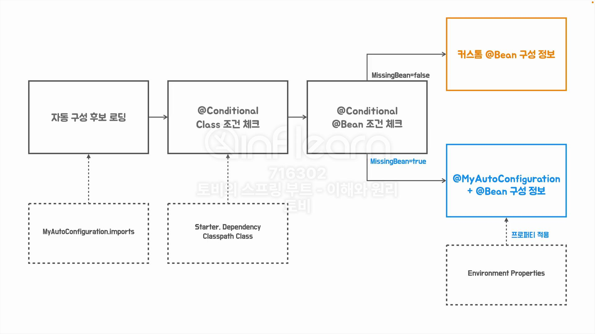
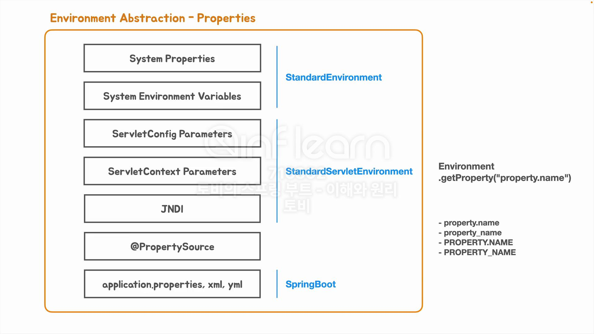

## [섹션 VIII] 46_Environment 추상화와 프로퍼티

자동 구성에 의해 만들어지는 Bean 오브젝트에는 대부분 디폴트 값이 들어가 있다. (Tomcat 의 기본 port 는 8080이다.)

우리는 지난 시간에 Custom Bean 구성정보를 등록해서 Tomcat 의 port 를 9090으로 변경하여 실행해보았다.

그러나 이렇게 Custom Bean 을 사용하는 것이 언제나 필요한 것은 아니다.

### Environment 추상화
애플리케이션의 동작 환경은 애플리케이션의 상황이나 동작 목적에 따라 달라질 수 있다. 이 과정을 지원하는 것이 스프링의 Environment 추상화 매커니즘이다.

Environment Abstraction : 애플리케이션의 환경 설정을 추상화하여 관리하는 메커니즘 
- 프로파일(Profiles)
  - 특정 환경에 따라 빈을 등록하고 관리하는 메커니즘
  - @Profile 애노테이션을 사용하여 구현
- 프로퍼티(Properties)
  - 다양한 소스로부터 키-값 쌍의 설정 정보를 관리
  - 프로퍼티 파일, 시스템 환경 변수, JVM 시스템 프로퍼티 등을 포함
  - 대표적으로 `application.properties` 파일을 통해 DB 구성 정보를 설정하는 것을 떠올릴 수 있다.
#### 주요 특징
- 일관된 접근 방식: 다양한 소스의 설정 정보를 일관된 방식으로 접근 가능1
- 유연한 구성: 코드 변경 없이 설정 정보 작성 방식 변경 가능1
- 환경별 설정: 개발, 테스트, 운영 등 다양한 환경에 따른 설정 관리2
- 통합된 추상화: 컨테이너와 통합된 서비스 추상화 제공1
