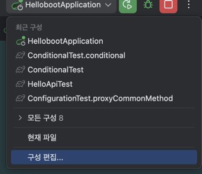
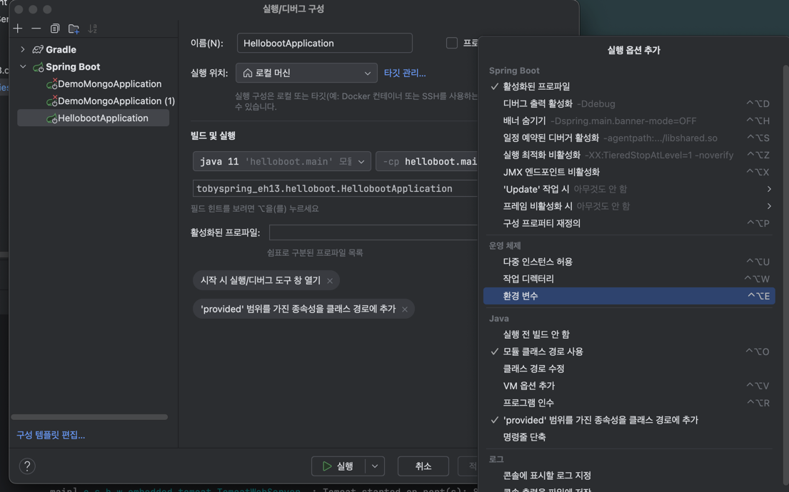
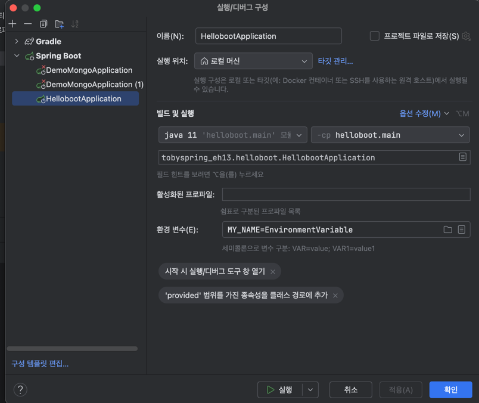
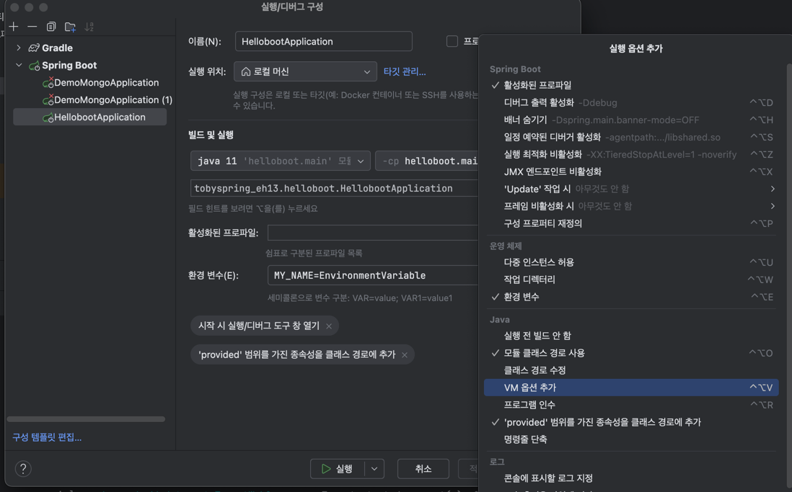
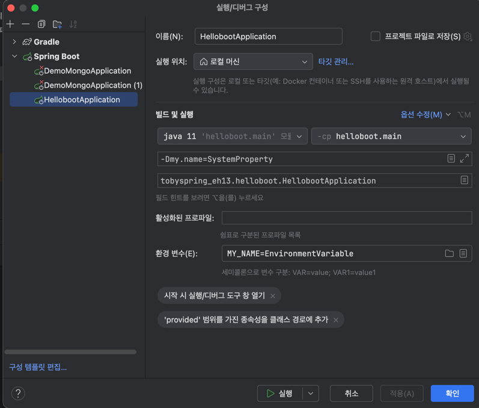

## [섹션 VIII] 47_자동 구성에 Environment 프로퍼티 적용

### Environment 프로퍼티 사용 테스트
```java
@MySpringBootApplication
public class HellobootApplication {

    @Bean
    ApplicationRunner applicationRunner(Environment env ) {
        return args -> {
            String name = env.getProperty("my.name");
            System.out.println("my.name: " + name);
        };
    }

    public static void main(String[] args) {
        SpringApplication.run(HellobootApplication.class, args);
    }
}
```

#### 우선 순위 Level 1
```properties
my.name=ApplicationProperties
```
- `application.properties` 파일 혹은 `yml` 파일로 설정하는 방법

#### 우선 순위 Level 2



- 환경 변수로 설정하는 방법 level 1 보다 우선 순위가 높다.

#### 우선 순위 Level 3


- VM 옵션을 추가하는 방법 level 2 보다 우선 순위가 높다.

가장 일반적으로 쓰이는 방법은 '우선 순위 Level 1' 방법인 `application.properties` 파일 혹은 `yml` 파일로 설정하는 방법이다.

### 자동 구성에 Environment 프로퍼티 적용 실전
```java
@MyAutoConfiguration
@ConditionalMyOnClass("org.apache.catalina.startup.Tomcat")
public class TomcatWebServerConfig {
    @Bean("TomcatWebServerConfig")
    @ConditionalOnMissingBean
    public ServletWebServerFactory servletWebServerFactory(Environment env) {
        TomcatServletWebServerFactory factory = new TomcatServletWebServerFactory();
        factory.setContextPath(env.getProperty("contextPath"));
        return factory;
    }
}
```
- `setContextPath()` : 웹 서버의 컨텍스트 경로를 설정한다.
  - 애플리케이션의 모든 URL이 설정한 컨텍스트 경로로 시작된다.

```properties
contextPath=/app
```

```
o.a.c.c.C.[Tomcat].[localhost].[/app]    : Initializing Spring embedded WebApplicationContext
w.s.c.ServletWebServerApplicationContext : Root WebApplicationContext: initialization completed in 146 ms
o.s.b.w.embedded.tomcat.TomcatWebServer  : Tomcat started on port(s): 8080 (http) with context path '/app'
t.helloboot.HellobootApplication         : Started HellobootApplication in 0.317 seconds (JVM running for 0.565)
```
- "Tomcat started on port(s): 8080 (http) with context path '/app'" 라인을 볼 수 있다.

```
apple2@chusang-uiguchehwa2ui-MacBookAir TIL % http "localhost:8080/app/hello?name=Spring"                                                           
HTTP/1.1 200 
Connection: keep-alive
Content-Length: 14
Content-Type: text/plain;charset=ISO-8859-1
Date: Tue, 01 Oct 2024 15:53:14 GMT
Keep-Alive: timeout=60

*Hello Spring*
```
- "localhost:8080/app/hello?name=Spring"으로 요청을 보내야 요청이 성공적으로 응답된다.