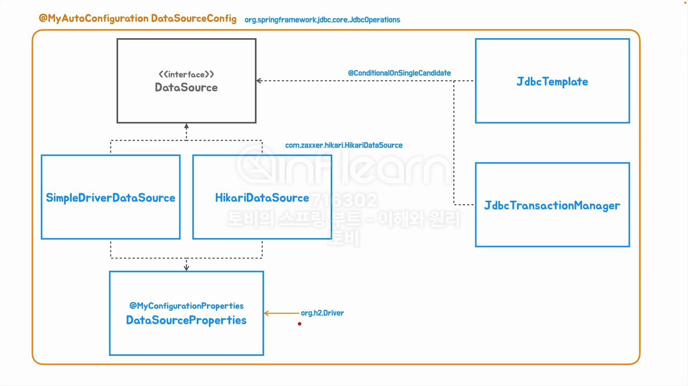

## [섹션 IX] 51_자동 구성 클래스와 빈 설계

지금까지 익혀왔던 스프링 부트의 자동 구성 방법으로 스프링 JDBC 가술을 사용하는 인프라스트럭쳐 빈을 생성하는 데 활용해 볼 것이다. (JDBC 템플릿을 사용해서 진행한다.)

목표는 JDBC를 이용해서 데이터베이스 프로그래밍을 하는 것 까지 작업을 해보려 한다.

- `DataSourceConfig` : DB와의 연결을 지원하는 JAVA 표준 구현 클래스로 만들 것이다.
  - `@MyAutoConfiguration` 을 붙여서 자동 구성 클래스로 구현하고자 한다.
- `JdbcOperations` : 스프링에서 제공하는 JDBC 템플릿의 핵심 서비스 인터페이스
  - Spring JDBC 모듈에 포함되어 있기 때문에 해당 클래스를 기준으로 JDBC 디펜더시 사용 여부를 알 수 있다.
  - 자동 구성을 불러오는 기준으로 사용할 예정이다.
- `SimpleDriverDataSource` : 스프링의 `DataSource` 인터페이스 기본 구현체
  - `DataSource` : DB와의 연결을 지원하는 스프링의 표준 인터페이스
- `DataSourceProperties` : DB 연결에 필요한 properties 를 관리하기 위한 클래스로 만들 것이다.
  - 내부적으로 `@MyConfigurationPropertiesAnnotation` 어노테이션을 부여한다.
- `HikariDataSource` : `SimpleDriverDataSource`가 성늠면에서 비효율적이기 때문에 스프링에도 `Hikari` 라이브러리가 기본적으로 들어있다.
  - `SimpleDriverDataSource` 대신 사용할 것.
  - `HikariDataSource` 클래스가 존재하면 `HikariDataSource`를 사용하고 그렇지 않으면 `SimpleDriverDataSource`를 사용하도록 구현해 볼 것이다.
- `JdbcTemplate` : 스프링의 JDBC 템플릿의 핵심 서비스 인터페이스
  - 간편한 SQL 실행을 지원한다. 역시 자동 구성 Bean 등록 대상으로 만들 것이다.
- `JdbcTransactionManager` :  트랜잭션 관리를 지원한다.

이후 H2 데이터베이스를 기본 값으로 사용하는 것까지를 해볼 것이다.